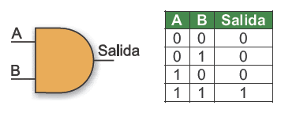
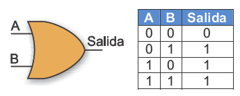
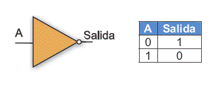
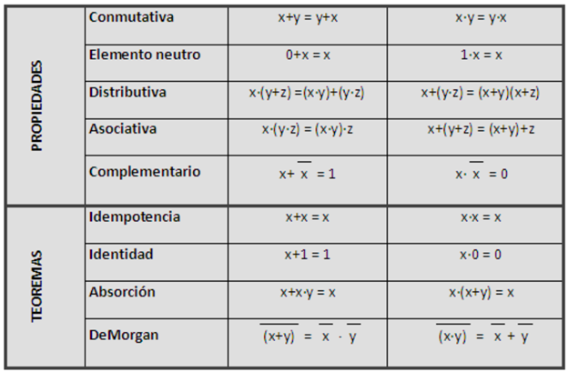
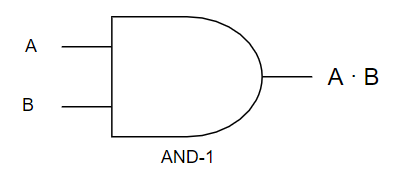
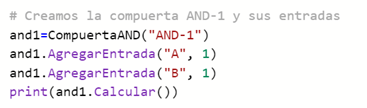
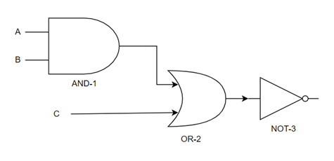
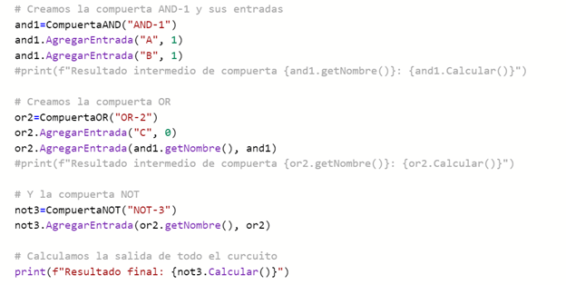

# Compuertas lógicas

Ahora que ya tienes más conceptos de programación orientada a objetos y de la sintáxis de C#, te proponemos escribir un ejercicio que ya es conocido... *las compuertas lógicas*.

## Definiciones previas

Una compuerta lógica es un dispositivo utilizado en electrónica digital que trabaja con estados lógicos tanto en sus entradas como en salidas y posee características especiales individuales que corresponden a leyes aritméticas.

Internamente una compuerta está formada por transistores. En cuanto a su operación externa, una compuerta tiene entradas y (típicamente) una salida. Tanto los valores de entrada como de la salida son de tipo booleano; el valor de la salida dependerá del tipo de compuerta que tengamos. Para esto, cada compuerta tiene asociada una tabla de verdad, que expresa en forma escrita el estado de su salida para cada combinación posible de estados en sus entradas. Ya que las compuertas tienen una o más entradas, la tabla de verdad muestra todas las posibles combinaciones de entradas y la salida correspondiente. Cabe aclarar que una tabla de verdad no es solamente para una compuerta específica, sino que puede ser también para un circuito formado por varias compuertas combinándose entre ellas.

#### Compuerta AND
Con dos o más entradas, esta compuerta realiza la función de la multiplicación en el álgebra booleana. Su salida será un 1 cuando todas sus entradas también sean 1. En cualquier otro caso, la salida será un 0. En efecto, el resultado de multiplicar entre si diferentes valores binarios solo dará como resultado 1 cuando todos ellos también sean 1, como se puede ver en su tabla de verdad. Matemáticamente se lo simbolizará con el signo " ∙ ". En el siguiente ejemplo representamos A ∙ B.

Si lo comparas con las expresiones booleanas de un lenguaje de programación como Python, el valor 0 corresponde a False, mientras que 1 corresponde a True. Luego, la tabla de verdad se corresponde con el operador and. 

#### Compuerta OR
La función que realiza la compuerta OR es la asociada a la suma, y matemáticamente la expresamos como + en el álgebra booleana. Esta compuerta presenta un estado alto en su salida (1) cuando al menos una de sus entradas también está en estado alto (1). En cualquier otro caso, cuando todas sus entradas son 0 la salida será 0. Tal como ocurre con otras compuertas, el número de entradas puede ser mayor a dos. En el siguiente ejemplo representamos A + B.

Como era de esperar, esta compuerta funciona de manera análoga al operador or en un lenguaje como Python (nuevamente, los 0 representan False y 1 True).

#### Compuerta NOT
Esta compuerta presenta en su salida un valor que es el opuesto al que está presente en su única entrada. En efecto, su función es la negación (el círculo en la salida significa que proporciona el estado opuesto). La figura muestra el símbolo utilizado en los esquemas de circuitos para representar esta compuerta, y su tabla de verdad. A menudo se la conoce como inversor. En el algebra booleana lo representamos con .

Como hemos visto, las compuertas lógicas no son más que representaciones electrónicas para los operadores lógicos, los cuales forman parte del álgebra de Boole. En el caso de Python, esta compuerta funciona de manera análoga al not.

A los efectos de completar estas definiciones, en el álgebra de Boole se destacan las propiedades que se resumen en la siguiente tabla:

### Objetivo del ejercicio
El objetivo será diseñar clases que modelen compuertas de tipo AND, OR y NOT. Estas 3 clases (una para cada compuerta) deberán proveer los siguientes métodos:

El constructor. El constructor recibirá como parámetro un string para indicar el nombre de la compuerta (el nombre será simplemente una etiqueta para diferenciar a cada compuerta).
Un método AgregarEntrada(nombre, valor), donde nombre es un string para indicar la entrada y valor un entero 0 o 1. Si la entrada no existe, entonces creará una con el valor indicado; si la entrada ya existe, entonces reemplazará el valor anterior con el del parámetro. La entrada también puede ser la salida de otra compuerta (eso lo explicaremos más adelante).
Un método Calcular(), que dados los valores de las entradas de la compuerta retorne su salida.
OBS: estos métodos son los mínimos indispensables. Uds. podrán definir otros que consideren convenientes.
Por ejemplo, para representar la siguiente compuerta AND llamada "AND-1":

crearíamos un objeto and1 de la clase CompuertaAND, y le agregaríamos dos entradas A y B (en el ejemplo, A con 1 y B con 1). Luego, para saber el resultado de operar esa compuerta utilizaríamos el método and1.Calcular(), el cual retornaría 1.

Ahora bien, nuestro modelo de objetos también debería ser capaz que representar circuitos con múltiples compuertas lógicas, como por ejemplo:

En este caso, la compuerta OR-2 recibe como entrada la salida de la compuerta AND anterior y además una nueva entrada C. Luego la salida es negada con la compuerta NOT-3. Usando nuestro modelo de objetos esto debería modelarse de la siguiente manera:

######  En este repositorio, podrás encontrar una posible solución del ejercicio en Python. Es hora de escribirla en C#. También puedes agregar casos de prueba (*tests*) para las compuertas!
